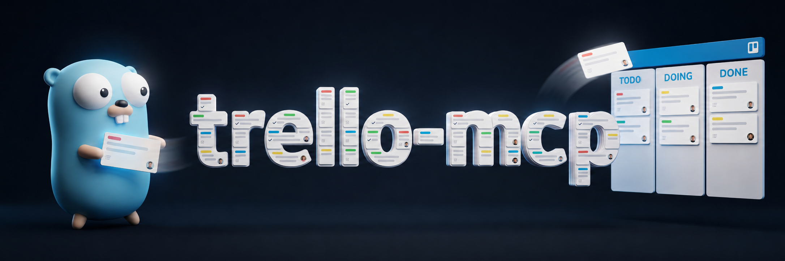

# trello-mcp

<p align="center">
  <a href="https://github.com/mab-go/trello-mcp/actions"></a>
  <a href="https://goreportcard.com/report/github.com/mab-go/trello-mcp"></a>
  <a href="https://pkg.go.dev/github.com/mab-go/trello-mcp"></a>
  <a href="https://deepwiki.com/mab-go/trello-mcp"></a>
  <a href="LICENSE"></a>
</p>

<p align="center">
  
</p>

<p align="center">
  <em>Finally, someone who'll keep your Trello board up to date.</em>
</p>

# What Is This?

A purpose-built [MCP (Model Context Protocol)](https://modelcontextprotocol.io)
server for Trello. Trello MCP gives any MCP-compatible AI client conversational
access to your Trello boards, lists, and cards. Browse boards, filter cards by
due date or label, create and update cards, and manage card lifecycle, all
through natural language.

Trello MCP is distributed as a single compiled binary, works over stdio
transport, and uses Trello API key + token authentication.

---

## Tools

### Tier 1: Core CRUD (Create/Read/Update/Delete)

| Tool                    | Description                                                     |
|-------------------------|-----------------------------------------------------------------|
| `trello_boards`         | List boards for the authenticated member, with optional filter  |
| `trello_lists`          | Get all open lists on a board                                   |
| `trello_cards`          | Get cards on a board or list, filtered by status/due/label      |
| `trello_get_card`       | Full detail for a single card including checklists and comments |
| `trello_create_card`    | Create a new card on a list by ID or name                       |
| `trello_update_card`    | Update card fields (title, description, due date, list, etc.)   |
| `trello_archive_card`   | Archive (close) a card                                          |
| `trello_unarchive_card` | Unarchive (reopen) a card                                       |
| `trello_add_comment`    | Add a comment to a card                                         |
| `trello_search`         | Search for cards and boards by keyword (Trello search syntax)   |

### Tier 2: Checklists & Labels

| Tool                    | Description                                                     |
|-------------------------|-----------------------------------------------------------------|
| `trello_checklists`     | Get all checklists on a card with their items                   |
| `trello_check_item`     | Check or uncheck a checklist item                               |
| `trello_add_checklist`  | Create a new checklist on a card, optionally with initial items |
| `trello_add_check_item` | Add an item to an existing checklist                            |
| `trello_labels`         | Get all labels on a board                                       |
| `trello_add_label`      | Add a label to a card                                           |
| `trello_remove_label`   | Remove a label from a card                                      |

### Tier 3: Workflow

| Tool                    | Description                                  |
|-------------------------|----------------------------------------------|
| `trello_add_attachment` | Attach a URL to a card                       |
| `trello_create_list`    | Create a new list on a board                 |
| `trello_board_summary`  | Get a high-level status overview of a board  |
| `trello_move_card`      | Move a card to a different board and/or list |

Tools that accept `board_id` fall back to `default_board` from your config
when the argument is omitted. When `allowed_boards` is set, all operations
are restricted to those boards.

List names are resolved case-insensitively. On zero matches, the error
response lists available list names. Label name matching in filters and
`trello_create_card` is also case-insensitive.

---

## Requirements

- Go (current stable)
- A Trello account with API access
- An MCP-compatible client (e.g., Claude Desktop, Claude Code)

---

## Installation

```bash
go install github.com/mab-go/trello-mcp@latest
```

Or build from source:

```bash
git clone https://github.com/mab-go/trello-mcp
cd trello-mcp
make build
```

---

## Setup

### 1. Get your Trello API key and token

See **[`SETUP.md`](SETUP.md)** for a step-by-step walkthrough.

The short version: visit the
[Trello Power-Up admin page](https://trello.com/power-ups/admin), create a new
integration, and generate an API key and token.

### 2. Create the config file

```bash
mkdir -p ~/.config/trello-mcp
```

Create `~/.config/trello-mcp/config.json`:

```json
{
  "api_key": "YOUR_API_KEY",
  "token": "YOUR_TOKEN",
  "default_board": "",
  "allowed_boards": []
}
```

`default_board` is optional; set it to a board ID if you want tool calls to work
without specifying `board_id` explicitly.

`allowed_boards` is optional; when non-empty, the server restricts all access to
only the listed board IDs.

### 3. Validate credentials

```bash
trello-mcp auth
```

This calls `GET /1/members/me` with your credentials and reports the
authenticated member's name and username.

### 4. Register with your MCP client

**Claude Desktop:** Add to `claude_desktop_config.json` (typically at
`~/.config/claude-desktop/claude_desktop_config.json`):

```json
{
  "mcpServers": {
    "trello": {
      "command": "/home/YOUR_USERNAME/go/bin/trello-mcp",
      "args": ["serve"]
    }
  }
}
```

Restart Claude Desktop. trello-mcp will appear in the tools list.

**Claude Code:** Add to `~/.claude/settings.json` (user-level) or
`.claude/settings.json` (project-level):

```json
{
  "mcpServers": {
    "trello": {
      "command": "/home/YOUR_USERNAME/go/bin/trello-mcp",
      "args": ["serve"]
    }
  }
}
```

---

## CLI Reference

```
trello-mcp serve          # Start MCP server (stdio); used by Claude Desktop
trello-mcp auth           # Validate API key and token against Trello
trello-mcp auth --status  # Check config file state without making an API call
trello-mcp version        # Print version and exit
```

---

## Development

First-time setup installs project-local tools (golangci-lint, goimports,
gocyclo) into `./bin`:

```bash
make setup
```

Build, test, and lint:

```bash
make build test lint
```

See `make help` for all available targets.

---

## What This Doesn't Do

By design, trello-mcp focuses on card-level operations:

- No board creation or deletion
- No list archiving or reordering
- No label creation or deletion (cards reference existing labels)
- No custom fields
- No Power-Up management
- No webhooks or real-time updates
- No member or organization management
- No file uploads (URL attachments only)

---

## License

MIT. See [LICENSE](LICENSE).
